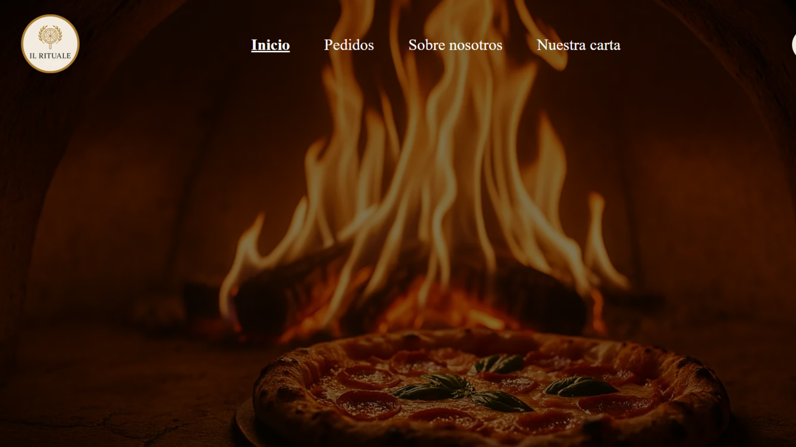
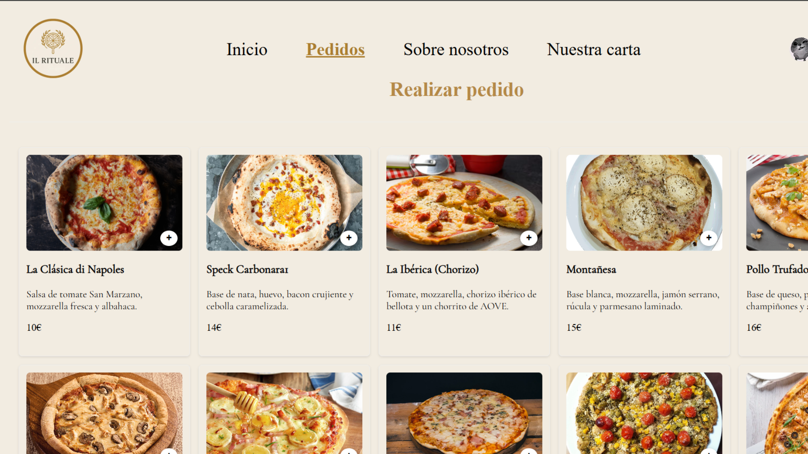
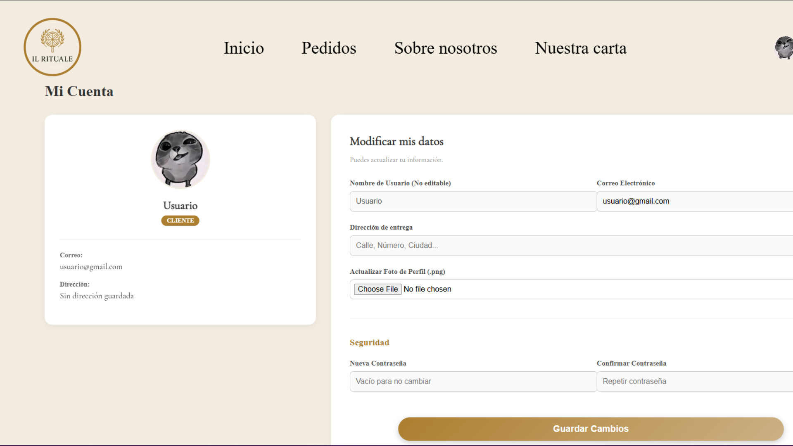
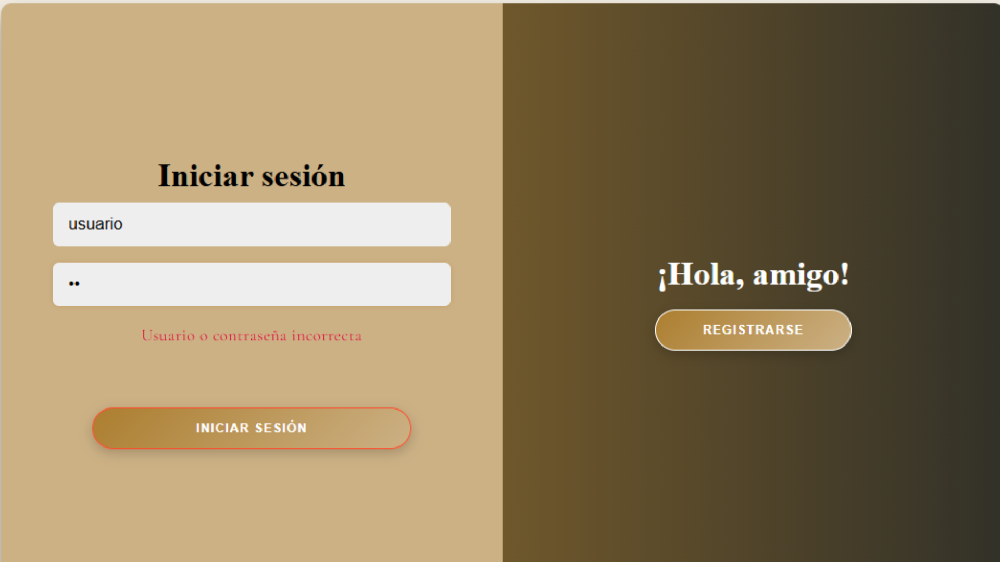
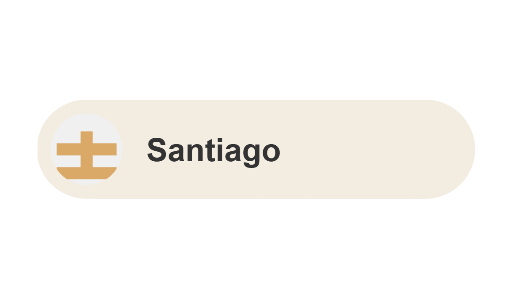

# IL Rituale - Sistema de Gestión y Pedidos para Restaurante

[]()
[]()
[]()

##  Descripción General del Proyecto

**IL Rituale** es una plataforma web full-stack integral diseñada para digitalizar y optimizar todos los procesos de un restaurante moderno. El sistema está dividido en dos grandes bloques funcionales que interactúan en tiempo real:

1. **Web de posicionamiento y Clientes (Escaparate Digital):** Una interfaz intuitiva donde los clientes pueden registrarse, explorar la carta de pizzas y platos, gestionar su carrito de compras y realizar pedidos en línea.
2. **Sistema Administrativo Interno (Dashboard):** Un panel de control privado, seguro y basado en roles para que el personal (Administradores, Chefs y Cocineros) gestione el inventario, actualice la carta y controle el flujo y estado de los pedidos.

---

## Tecnologias usadas

       

---


## Galería del Proyecto

Aquí tienes un vistazo de las interfaces principales que componen el ecosistema de **IL Rituale**:

|  Home Principal |  Carta y Pedidos |
| :---: | :---: |
|  |  |
| *Escaparate digital con identidad visual propia.* | *Sistema de carrito dinámico y selección de platos.* |

|  Perfil del Usuario | Inicio de sesion del usuario |
| :---: | :---: |
|  |  |
| *Dashboard y datos del usuario.* | *Login de usuario.* |

---

##  Arquitectura y Componentes

Este proyecto aplica una arquitectura cliente-servidor estricta, separando la lógica de negocio, la persistencia de datos y la interfaz de usuario:

### 1. Backend API REST (Spring Boot)
* **Seguridad:** Autenticación y autorización mediante JWT (JSON Web Tokens) y Spring Security. Filtrado de endpoints según el rol (`ROLE_ADMIN`, `ROLE_CHEF`, `ROLE_CLIENTE`).
* **Lógica de Negocio:** Gestión de estados de pedidos y vinculación de ingredientes a platos mediante tablas intermedias.
* **Gestión de Archivos:** Lógica de subida y almacenamiento de imágenes (`multipart/form-data`) de forma local para avatares, ingredientes y platos.

### 2. Frontend Web (React + Vite)
* **SPA (Single Page Application):** Navegación rápida y sin recargas usando `react-router-dom`.
* **Gestión de Estados:** Uso de Context API para mantener la sesión del usuario (JWT).
* **UI/UX:** Componentes reutilizables, alertas dinámicas y diseño responsive adaptado a móviles y escritorio. Renderizado condicional del dashboard según el rol del usuario.

### 3. Base de Datos (MySQL)
* Diseño relacional optimizado con claves foráneas.
* Control de usuarios, ingredientes, platos a facturas

---

## Estructura del Repositorio

```text
## 📁 Estructura del Repositorio

La estructura del código sigue un patrón arquitectónico claro para separar responsabilidades:

gestionPedidosRestaurante/
├── Documentacion/                 # Manuales, diagramas E/R y memorias
├── Backend/                       # API REST (Java + Spring Boot)
│   ├── src/main/java/.../pedidos/
│   │   ├── chatbot/               # Lógica del asistente virtual/chatbot
│   │   ├── controller/            # Endpoints de la API REST (Rutas)
│   │   ├── data/                  # Inicialización de datos de prueba
│   │   ├── DTO/                   # Objetos de Transferencia de Datos
│   │   ├── models/                # Entidades JPA (Mapeo objeto-relacional)
│   │   ├── repository/            # Interfaces de Spring Data JPA para BD
│   │   ├── security/              # Configuración de CORS, JWT y Roles
│   │   └── service/               # Lógica de negocio de la aplicación
│   ├── src/main/resources/
│   │   └── application.properties # Credenciales de MySQL y servidor
│   └── pom.xml                    # Gestión de dependencias de Maven
└── Frontend/pedidos/              # Aplicación Cliente (React + Vite)
    ├── src/
    │   ├── assets/                # Imágenes estáticas, avatares y SVGs
    │   ├── components/            # Componentes visuales reutilizables de UI
    │   ├── hook/                  # Custom Hooks (Abstracción de estados globales)
    │   ├── pages/                 # Vistas principales de la aplicación (Pantallas)
    │   └── service/               # Configuración de peticiones HTTP a la API
    └── package.json               # Dependencias de Node y scripts de NPM
```


## Estado del Proyecto y Funcionalidades

- [x] **Autenticación y Seguridad:** Login, registro y encriptación de contraseñas (BCrypt) y JWT para autentificación de usuarios.
- [x] **Gestión de Usuarios:** CRUD completo y asignación de roles.
- [x] **Gestión de la Carta (Platos):** Creación de platos, subida de imágenes y vinculación de ingredientes.
- [x] **Inventario de Ingredientes:** Control de stock, alérgenos y opciones veganas.
- [x] **Flujo de Pedidos:** Carrito de compras, tramitación de pedidos.

---

## Como realizar la instalación local

1. Clona el repositorio: 
   git clone https://github.com/Makima32/gestionPedidosRestaurante.git
2. Arranca Xampp y ejecuta el servidor apache y mysql
3. Configura tu conexión a MySQL en `src/main/resources/application.properties`.
4. Ejecuta `PedidosAplicacion.java` desde tu IDE (Arrancará en el puerto 8080).

5. Navega al directorio: 
   cd Frontend/pedidos
6. Instala dependencias: 
   npm install
7. Arranca el entorno de desarrollo: 
   npm run dev
8. Accede a `http://localhost:5173`.

---

## Documentación 

Para conocer en profundidad la arquitectura del sistema, el diagrama de la base de datos (E/R), y aprender a interactuar con la plataforma, consulta nuestras documentaciones :

*  [Memoria Completa del Proyecto (PDF)](./Documentacion/documentacionTODOENUNO.pdf)
*  [Documentación Técnica (PDF)](./Documentacion/documentacion.pdf)
*  [Manual de Usuario (PDF)](./Documentacion/manualUsuario.pdf)
*  [Guía de Instalación (PDF)](./Documentacion/manualInstalacion.pdf)

---

##  Equipo de Desarrollo

Este proyecto ha sido diseñado, desarrollado y mantenido por:

<div align="center">
  <a href="https://github.com/Makima32">
    
  </a>
  &nbsp;&nbsp;&nbsp;&nbsp;
  <a href="https://github.com/Santiagoooo1">
    
  </a>
</div>
